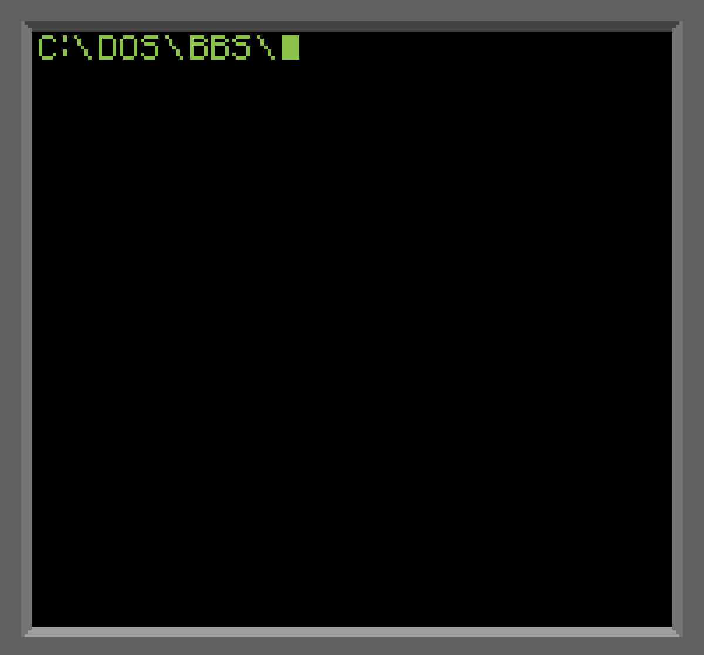

## 👾 I use nvim btw
<ul>
    <li>
because I don't know how to exit it
</li>

<li>
    
<i>“If you wish to make an apple pie from scratch,</i>

<i>you must first invent the universe.”</i> - Carl Sagan
</li>

</ul>

